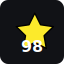
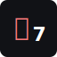

# Hey, I'm Shabnam 👋

> Backend Developer | AI Enthusiast

<!-- > _“Beyond the screen, a universe of code.”_ -->

<!--  -->
<!-- 
<i>Allegedly, I have a great personality.</i>
 -->

---

## 🧩 Tech Stack

**Languages:** Python, TypeScript, JavaScript, C++  
**Frameworks & Libraries:** FastAPI, NestJS, Django, Express.js, React  
**Tools & Platforms:** Docker, AWS, GitLab CI/CD  
**Focus Areas:** Backend Architecture, API Design, System Scalability

---

<!-- my-badges start -->

  <!-- generated badges -->
  
  
  
  
  
  
  
  
  
  
  
  

<!-- my-badges end -->

## 📊 Stats

<table role="presentation" style="width:100%;max-width:760px;margin:0 auto;border-collapse:collapse;border-spacing:0;">
  <tr style="border:none;">
    <td align="center" style="width:60%;padding:4px;vertical-align:top;border:none;background:transparent;">
      
    </td>
    <td align="center" style="width:40%;padding:6px;vertical-align:top;border:none;background:transparent;">
      
    </td>
  </tr>
</table>

---

<!-- ## 🎮 Play Chess with Me
 -->

<!-- ## 🎧 Now Playing
 -->

---

## ✨ Random Dev Quote

---

## 🔗 Connect with Me

