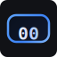
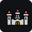
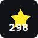
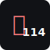
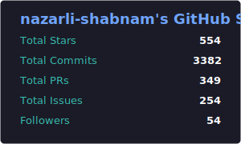
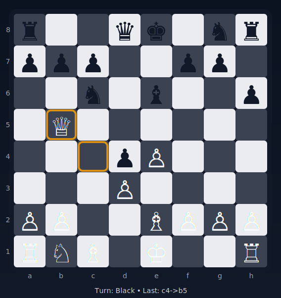

# Hey, I'm Shabnam 👋

<h3>Software Engineer</h3>

> _“Beyond the screen, a universe of code.”_

<!--  -->
<!-- 
<i>Allegedly, I have a great personality.</i>
 -->

---

## 🚀 Recent Activity

<!-- recent-repos start -->
<!-- generated by scripts/update-recent-repos.mjs (5d window, since 2026-04-10) -->

Public activity in the last **5 days** (from GitHub’s public event feed — **private repos are not listed**).

**Repos I’ve been active in:**

- [Devlaner/devlane](https://github.com/Devlaner/devlane)
- [nazarli-shabnam/git-explain](https://github.com/nazarli-shabnam/git-explain)
- [Devlaner/clevis](https://github.com/Devlaner/clevis)

_Links go to the repo, not individual commits._

<!-- recent-repos end -->

---

<!-- my-badges start -->

  <!-- generated badges -->
  
  
  
  
  
  
  
  
  
  
  
  
  
  
  

<!-- my-badges end -->

## 📊 Stats

<table role="presentation" style="width:100%;max-width:760px;margin:0 auto;border-collapse:collapse;border-spacing:0;">
  <tr style="border:none;">
    <td align="center" style="width:60%;padding:4px;vertical-align:top;border:none;background:transparent;">
      
    </td>
    <td align="center" style="width:40%;padding:6px;vertical-align:top;border:none;background:transparent;">
      
    </td>
  </tr>
  <tr style="border:none;">
    <td colspan="2" align="center" style="padding:12px 4px 4px;border:none;background:transparent;">
      
    </td>
  </tr>
</table>

---

## 🎮 Play Chess with Me

It’s an **open chess game** — anyone can play by opening an issue.

- **Make a move**: open an issue titled `chess: e2e4` (also supports `chess: move e2 to e4`)
- **Rules**: strict chess legality (check, castling, en passant, promotion, etc.)

  

<!-- ## 🎧 Now Playing
 -->

---

## ✨ Random Dev Quote

---

## 🔗 Connect with Me

